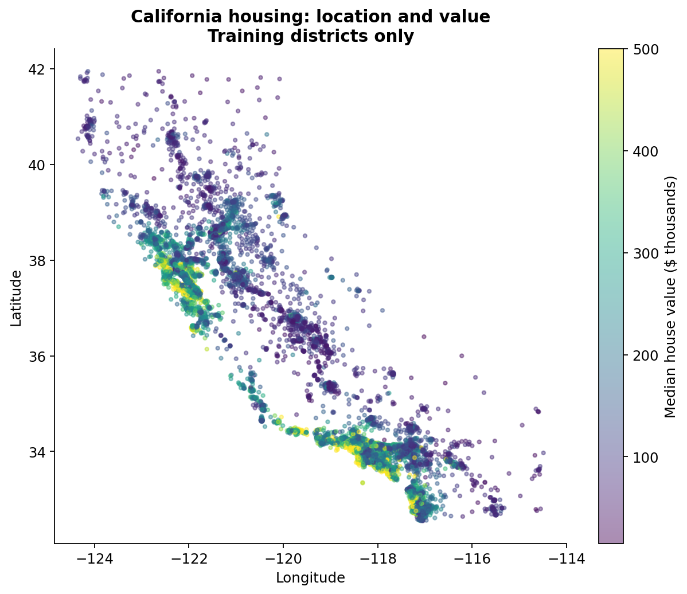
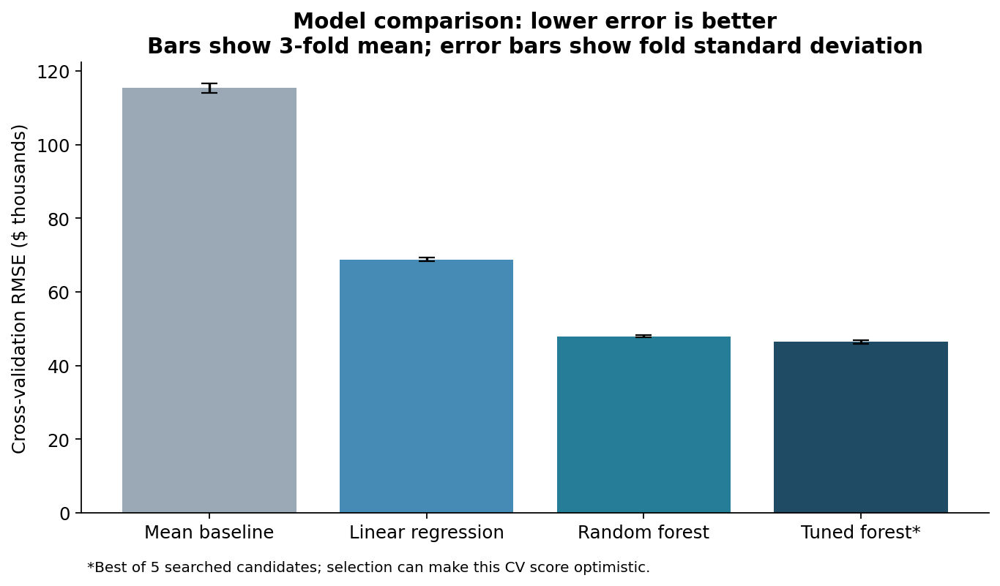
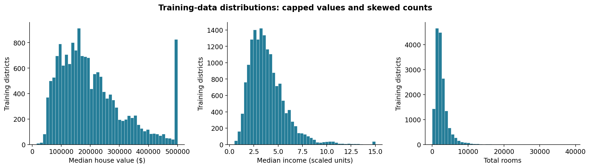
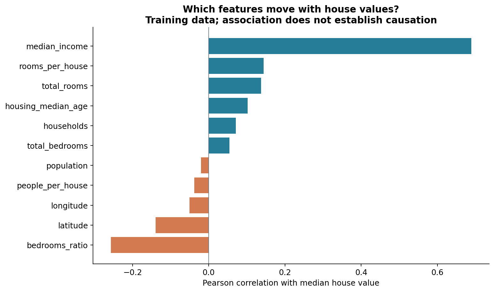
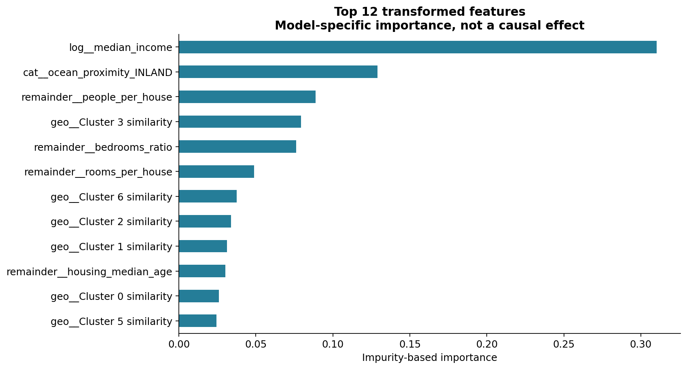
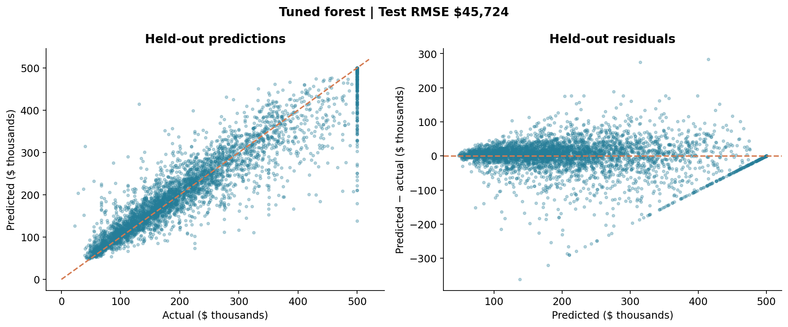

# California Housing — End-to-End Regression

This project uses **20,640 California housing districts** to learn how location, income, housing characteristics, and population relate to home values. **Each row describes one district (a census block group), not an individual house.** The dataset has **10 columns: nine input features and one target, `median_house_value`**. The goal is to predict a district's median house value in dollars from its nine input features. This is a **supervised regression problem** because the output is a numeric dollar amount, rather than a category such as “expensive” or “affordable.” The data is historical, associated with the 1990 census, so the predictions represent historical district values rather than current home prices.

### What goes in, and what comes out?

Here is a real district from the held-out test set, with the prediction produced by the fitted model:

| Input field | Example value | What it describes |
|---|---:|---|
| `longitude` | -121.95 | East–west location in degrees |
| `latitude` | 37.11 | North–south location in degrees |
| `housing_median_age` | 21.0 | Median housing age in years |
| `total_rooms` | 2387.0 | Total rooms across the district |
| `total_bedrooms` | 357.0 | Total bedrooms across the district |
| `population` | 913.0 | Number of residents |
| `households` | 341.0 | Number of households |
| `median_income` | 7.736 | Scaled median household income (approximately $10,000 units) |
| `ocean_proximity` | <1H OCEAN | Location relative to the ocean or bay |

**Model output:** a predicted `median_house_value` of **$422,828** for this district. Its recorded value is **$397,700**, giving an absolute error of **$25,128**. This example comes from district index `3905` in [the saved test predictions](reports/test_predictions.csv).

During training, the model sees the input features together with the recorded target values and learns their relationships. When predicting a new district, it receives **only the nine inputs**; the actual house value is not supplied. The output estimates the median value across the district, not the price of a specific property.

### From raw inputs to a prediction

The workflow adds ratio features, fills missing values, transforms numeric and categorical inputs, and creates geographic similarity features. It then compares linear regression with a random forest, tunes the forest using cross-validation, and evaluates the selected model on held-out districts. The sections below show the results, exploratory charts, and the full preprocessing and modeling pipeline.



## Results from the reproducible experiment

<!-- RESULTS_START -->
**Test RMSE: $45,724 · MAE: $29,300 · R²: 0.844**

The tuned forest reduced held-out RMSE by **60.5%** versus a mean-only predictor (baseline test RMSE: $115,727).

| Model | 3-fold CV RMSE, mean ± SD |
|---|---:|
| Mean baseline | $115,306 ± $1,221 |
| Linear regression | $68,819 ± $523 |
| Random forest | $47,941 ± $330 |
| Tuned random forest (selected candidate) | $46,404 |

**95% bootstrap interval for test RMSE: $43,586–$47,846.**

Selected parameters: `{'randomforestregressor__max_features': 7, 'columntransformer__geo__n_clusters': 7}`. The saved-and-reloaded model reproduced all test predictions exactly.

These values come from the committed [metrics.json](reports/metrics.json), not an illustrative example.
<!-- RESULTS_END -->

RMSE is in dollars and penalizes large misses more strongly than MAE. These are errors on district median values, not individual home appraisals. The bootstrap interval describes variation in aggregate test RMSE when resampling the observed test districts with the fitted model held fixed; it is not a prediction interval for a new district.



## What is in the dataset?

The included [data/housing.csv](data/housing.csv) has **20,640 rows and 10 columns**: nine raw predictors and one target. Each row represents a California district (census block group). This is historical housing data associated with the 1990 census; values should not be interpreted as current market prices.

| Column | Meaning |
|---|---|
| `longitude`, `latitude` | Geographic location in degrees |
| `housing_median_age` | Median age of housing in the district, in years |
| `total_rooms` | Total rooms across the district |
| `total_bedrooms` | Total bedrooms; 207 values are missing |
| `population` | District population |
| `households` | Number of households |
| `median_income` | Scaled median household income, approximately in $10,000 units |
| `ocean_proximity` | Categorical proximity to the ocean or bay |
| `median_house_value` | **Prediction target:** district median house value in dollars |

The source is [Aurélien Géron's housing dataset](https://github.com/ageron/data/tree/main/housing), used by [Hands-On Machine Learning, chapter 2](https://github.com/ageron/handson-ml3/blob/main/02_end_to_end_machine_learning_project.ipynb). The raw CSV is included unchanged. See [data/README.md](data/README.md) for provenance and a file checksum. This CSV includes `ocean_proximity`; it is not the identical feature table returned by scikit-learn's `fetch_california_housing()`.

## What the exploration shows

All exploratory figures use the **training set only**. The test set is reserved for evaluation after model selection.



- House values have a pile-up at the upper recorded value, $500,001. This limits what can be learned about expensive districts.
- Room counts have a long right tail. Log transformations compress positive count and income features before modeling.
- Location contains useful structure: coastal and inland districts have different value patterns. Geographic clustering provides continuous similarity features.
- Missing bedroom counts require imputation learned inside each training fold.



Pearson correlation describes linear association, not causation. A small correlation does not rule out a nonlinear relationship. Ratios offer information that raw totals alone may miss:

| Engineered feature | Formula | Interpretation |
|---|---|---|
| `rooms_per_house` | `total_rooms / households` | Rooms per household |
| `bedrooms_ratio` | `total_bedrooms / total_rooms` | Share of rooms that are bedrooms |
| `people_per_house` | `population / households` | People per household |

The ratios do not learn parameters and are created before the fitted preprocessing pipeline. The `predict_new()` helper applies the same formulas at inference time.

## How the system works

```text
Raw district records
        │
        ├── Income-stratified split: 80% training / 20% test
        │
        └── Add three ratio features; separate target
                    │
             ColumnTransformer
                    ├── Counts + income: median imputation → log → scaling
                    ├── Latitude/longitude: KMeans centers → RBF similarities
                    ├── Ocean proximity: mode imputation → one-hot encoding
                    └── Other numeric features: median imputation → scaling
                    │
             Linear regression / random forest
                    │
             Cross-validation → randomized search
                    │
             Independent test evaluation → saved pipeline → predictions
```

`fit()` learns quantities such as medians, category vocabulary, cluster centers, and model parameters. `transform()` applies learned preprocessing. `predict()` applies preprocessing and then the regressor. Keeping learned preprocessing inside the pipeline means each cross-validation training fold learns its own preprocessing without seeing its validation fold.

Income categories use `(0, 1.5]`, `(1.5, 3]`, `(3, 4.5]`, `(4.5, 6]`, and `(6, ∞]` solely to preserve income proportions in the initial split. They are not added as a model input.

## Every implemented step

| Step | Function / class | Purpose |
|---|---|---|
| 1 | `load_housing` | Cache the compressed archive in the system temp directory and read its CSV |
| 2 | `income_categories` | Bin income into five groups for stratification |
| 3 | `stratified_split` | Reserve a reproducible 20% test set |
| 4 | `explore_correlations` | Rank numeric Pearson correlations with the target |
| 5 | `add_ratio_features` | Add three ratios without changing the input |
| 6 | `split_features_labels` | Separate predictors `X` and target `y` |
| 7 | `ClusterSimilarity` | Learn geographic centers and calculate RBF similarities |
| 8 | `numeric_pipeline` | Fill numeric gaps and standardize values |
| 9 | `categorical_pipeline` | Normalize missing markers, fill categories, and one-hot encode |
| 10 | `build_preprocessing` | Route columns through the appropriate transformations |
| 11 | `rmse` | Calculate root mean squared prediction error |
| 12 | `dummy_baseline_rmse` | Measure training error of a mean-only predictor |
| 13 | `cross_val_rmse` | Return fold RMSE values, their mean, and standard deviation |
| 14 | `linear_model` | Combine preprocessing with linear regression |
| 15 | `forest_model` | Combine preprocessing with a random forest |
| 16 | `random_search` | Tune cluster count and forest feature sampling inside CV |
| 17 | `test_rmse` | Evaluate a fitted pipeline without refitting |
| 18 | `bootstrap_rmse_ci` | Resample test pairs to estimate RMSE uncertainty |
| 19 | `feature_importances` | Rank named transformed features by forest importance |
| 20 | `worst_errors` | Inspect the districts with the largest absolute misses |
| 21 | `save_and_reload` | Persist and restore a fitted pipeline with joblib |
| 22 | `predict_new` | Convert raw district dictionaries into rounded predictions |

## Evaluation design

The full experiment (`report.py`) uses all **16,512 training rows** and **4,128 held-out test rows**. Models use identical 3-fold CV partitions. The mean baseline is also cross-validated for a fair comparison; its training-only helper is not used as a validation score.

Randomized search evaluates **5 of 56 possible parameter combinations**: `geo.n_clusters` from 3–10 and `max_features` from 2–8. Each forest has 50 trees. Random seeds are 42. The chosen estimator is automatically refitted on the full training set. Its test predictions are then used for RMSE, MAE, R², a 200-resample bootstrap interval, and error diagnostics. No hyperparameters are selected using the test results.

The winning search CV score is a model-selection statistic and may be optimistic. The test score is the independent estimate. `scaffold.py` provides a faster demonstration: it uses a 4,000-row training sample, 30 trees, and 3 search candidates, so its scores differ from this README.

## What the model learns and where it fails



These are impurity-based forest importances. Correlated inputs can share importance, and this method can favor features with many possible split points. These scores do not measure causal effects. Permutation importance on a separate validation partition is a useful next analysis.



The dashed diagonal represents perfect predictions. In the residual plot, values below zero mean underprediction. The upper target cap deserves particular attention when interpreting large errors. Exact predictions and worst misses are saved in [reports/test_predictions.csv](reports/test_predictions.csv) and [reports/worst_errors.csv](reports/worst_errors.csv).

## Reproduce the project

Use Python 3.12 and the pinned package versions to match the recorded environment most closely:

```bash
python -m venv .venv
source .venv/bin/activate
# Windows: .venv\Scripts\activate
python -m pip install -r requirements.txt
python checks.py
python report.py
```

`report.py` reads the included CSV, trains models, and regenerates six figures, metrics, search results, diagnostic CSVs, and `artifacts/housing_pipeline.pkl`. If the CSV is absent, it uses `load_housing()` to fetch the source archive and restore it. Runtime depends on hardware; exact floating-point results may vary across environments. Measured versions and runtime are recorded in [reports/metrics.json](reports/metrics.json).

The README's results block is refreshed automatically from the generated metrics. If you change the experiment design, update the surrounding explanation too.

To run the compact workflow:

```bash
python scaffold.py
```

To predict a raw district after generating the model:

```python
import joblib
from model import predict_new

pipeline = joblib.load("artifacts/housing_pipeline.pkl")
districts = [{
    "longitude": -122.2, "latitude": 37.8,
    "housing_median_age": 30.0, "total_rooms": 2000.0,
    "total_bedrooms": 400.0, "population": 1000.0,
    "households": 380.0, "median_income": 5.5,
    "ocean_proximity": "NEAR BAY",
}]
print(predict_new(pipeline, districts))
```

Keep `model.py` importable when loading: it defines the custom transformer and missing-value normalization function. Load only trusted joblib artifacts. Generated model files are excluded from Git; recreate them with the report script.

## Repository layout

```text
model.py                   # Reusable ML functions and custom transformer
scaffold.py                # Compact demonstration run
report.py                  # Full experiment and chart generation
update_readme.py            # Refresh the measured-results table
checks.py                  # Boundary, missing-value, and immutability checks
requirements.txt           # Pinned experiment dependencies
data/housing.csv           # Unmodified raw dataset
data/README.md             # Source and checksum
reports/figures/            # Six README figures
reports/metrics.json       # Measured scores, configuration and versions
reports/search_results.csv # All searched candidates and fold scores
reports/*.csv              # Feature importance and error analysis
artifacts/                 # Locally generated fitted model (ignored by Git)
```

## Limitations and next improvements

1. **Historical, aggregated data:** this demonstrates an ML workflow; it is not a current-price valuation service. District-level predictions do not describe any specific household or property.
2. **Spatial dependence:** nearby districts can appear on both sides of the random split. Try geographic group cross-validation to test generalization to unseen areas.
3. **Capped targets:** values at $500,001 conceal the true upper tail. Document cap-sensitive errors before changing the target strategy.
4. **Small search budget:** five candidates are a starting point. Broaden tuning on training folds and compare a histogram gradient-boosting model under the same protocol.
5. **Input robustness:** ratios require nonzero denominators and `np.log` requires positive inputs. Add explicit schema and range validation for new districts. Unknown ocean categories are supported, but malformed numeric inputs are not yet handled.
6. **Inference packaging:** move ratio creation into a named, serializable transformer inside the saved pipeline so consumers can call `predict()` directly on raw records.
7. **Uncertainty and explanation:** use spatially aware uncertainty estimates, validation-set permutation importance, and subgroup error analysis. The current bootstrap ignores spatial dependence and retraining variability.
8. **Learning presentation:** add a narrative notebook explaining each chart and modeling decision. If test diagnostics motivate another modeling iteration, use a new evaluation protocol rather than repeatedly optimizing this test score.

## Data and references

- [Download the California housing dataset (.tgz)](https://github.com/ageron/data/raw/main/housing.tgz)
- [Browse the source CSV](https://github.com/ageron/data/blob/main/housing/housing.csv)
- [Included dataset and provenance](data/README.md)
- [Reference: Hands-On Machine Learning, chapter 2](https://github.com/ageron/handson-ml3/blob/main/02_end_to_end_machine_learning_project.ipynb)

The dataset and reference material are credited to their original sources. All reported metrics and charts were generated by the experiments in this repository.
